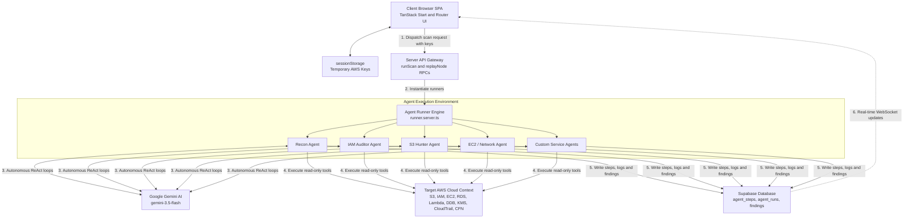

# Cirrus
> **Autonomous Zero-Trust Cloud Pentesting and Drift Remediation**
>
> Read the [Technical Documentation](TECHNICAL_DOCUMENTATION.md) for detailed architecture, design specifications, and database schemas.

Cirrus is a cloud security platform that deploys autonomous, context-aware AI agents to perform security audits, identify misconfigurations, and deploy automated, audited remediations on target AWS environments. Designed with a strict zero-trust posture, Cirrus handles runtime AWS credential payloads in-memory, completely avoiding the persistence of access keys in the database.

---

## Key Features

* **Zero-Trust Key Lifecycle**: AWS credentials (Access Key ID, Secret Access Key, Session Token) are requested at runtime, cached locally in client-side sessionStorage, and passed over secure SSL headers to short-lived RPC endpoints. They are never saved to a database.
* **Autonomous Agent Workflows**: Driven by gemini-3.5-flash using Vercel AI SDK, agents reason about audit goals, execute read-only API scans, and log thoughts and evidence incrementally.
  * **Recon Agent**: Discovers caller identities, active regions, and root configurations.
  * **IAM Auditor**: Enters role/user policies, analyzes wildcards, and flags aged keys.
  * **S3 Hunter**: Audits bucket configurations for public block access, public policies, and default encryption.
  * **EC2 / Network Agent**: Discovers security groups open to the world (0.0.0.0/0) on sensitive ports.
* **Custom Agent Builder**: Define your own prompts, white-list specific AWS service boundaries (RDS, Lambda, DynamoDB, KMS, CloudTrail), and use safety filters to automatically block mutating instructions.
* **Real-time Timeline and Regex Search**: Watch agents run live via Supabase WebSockets. Search agent thoughts and tool outputs using exact matching or regular expression pattern filters.
* **Automated CloudFormation Playbook Remediation**: For every finding, Gemini generates an explanation, rollback playbook, and safe CloudFormation template. Fixes audit execution steps and automatically polls/logs stack events.
* **Capability Validation**: Forces explicit acknowledgment of named IAM resource adjustments (CAPABILITY_NAMED_IAM) before applying fixes to safeguard cloud configurations.
* **Baseline Drift Scheduling**: Define recurring scans to check for drift compared to baseline settings and receive notifications via Resend email integration.

---

## System Architecture


<p align="center"><strong>Figure 1: Cirrus Zero-Trust Orchestration Architecture</strong></p>

### Flow-by-Flow Explanation

1. **Credentials Staging**: When users inputs AWS credentials on the frontend, the keys are cached locally in the client browser's sessionStorage. They are never stored in the database.
2. **Scan Initiation**: The client initiates an RPC (Remote Procedure Call) request to the server-side runScan function, attaching the credentials in the payload.
3. **LLM Connection**: The runner loads the agent's context and starts a conversation with gemini-3.5-flash using the Vercel AI SDK.
4. **Autonomous Tools Query**: The agent makes decision calls. If it chooses to audit a resource, the runner translates this into an AWS SDK V3 client query (S3, EC2, Lambda, RDS, etc.) using the temp keys.
5. **Timeline Reporting**: Every thought, action, and JSON result is written directly to the Supabase database under agent_steps.
6. **Real-time Streaming**: PostgreSQL emits changes through WebSockets, and the browser UI dynamically updates the console log timeline in real-time.
7. **Remediation Plan**: Clicking "Apply CloudFormation fix" executes stack deployments to repair the target system and logs each creation/rollback stack event in real time.

---

## Tech Stack

* **Frontend**: React, TanStack Start (SSR), TanStack Router, Tailwind CSS, Framer Motion, Lucide, Shadcn UI.
* **Server**: Nitro engine, NodeJS.
* **AI Provider**: @ai-sdk/google + Google Gemini API (gemini-3.5-flash).
* **Database and Auth**: Supabase PostgreSQL database, Supabase Realtime WebSocket engine, Supabase GoTrue Auth.
* **Infrastructure integration**: AWS SDK v3, Resend API.

---

## Setup Instructions

Follow these commands to deploy the application locally:

### 1. Clone and Install
```bash
git clone https://github.com/ritvikindupuri/CIRRUSPenTest.git
cd CIRRUSPenTest
npm install
```

### 2. Configure Environment variables
Create a `.env` file in the root directory:
```bash
# Copy template or write details
notepad .env
```
Add the following keys:
```env
SUPABASE_PROJECT_ID="your_supabase_project_id"
SUPABASE_PUBLISHABLE_KEY="your_supabase_anon_publishable_key"
SUPABASE_URL="https://your_project_id.supabase.co"

GEMINI_API_KEY="your_google_gemini_api_key"
```

### 3. Initialize Database Migrations
If setting up a new Supabase project, execute the SQL migration scripts located in supabase/migrations/ sequentially in the Supabase SQL editor:
1. `20260611175800_add_last_reminded_at.sql`
2. `20260611181200_add_resend_settings_to_profiles.sql`
3. `20260611181500_advanced_features_schema.sql`

### 4. Build and Launch
Run the Vite development server locally:
```bash
npm run dev
```
Open **[http://localhost:8080/](http://localhost:8080/)** in your browser.

---

## How to Use the App: Click-by-Click Guide

### Step 1: Sign Up and Connect AWS Credentials
1. Navigate to the login page and sign up using your email and password.
2. Once on the Dashboard, click the "AWS Connection Setup" button.
3. Review the consolidated read-only policy template and create an IAM role or user in your AWS Console.
4. Copy your temporary credentials (Access Key ID, Secret Access Key, Session Token) and paste them into the credentials form modal.
5. Click "Save Credentials" (they will be saved in your browser's local session memory).

### Step 2: Running a Cloud Scan
1. On the dashboard, click "New Scan".
2. Give the scan a descriptive name (e.g. Weekly S3 Audit).
3. Select which agents you want to dispatch (Recon, S3 Hunter, IAM Auditor, EC2 Network, or any Custom agents you created).
4. Specify the target AWS region (e.g. us-east-1).
5. Click "Start Scan".

### Step 3: Monitoring the Live Agent Timeline
1. You will be redirected to the live scan page.
2. In the interactive canvas, click on any active agent node to inspect its execution.
3. In the panel, watch the reasoning logs, executed CLI commands, and raw JSON outputs stream in real-time.
4. **Filtering**: Use the filter chips (Reasoning, Commands, Outputs, Final, Violations) to isolate specific details.
5. **Regex Search**: Type text into the search bar, toggle the .* button, and search the timeline using regular expressions.
6. If an agent hits a safety rule violation, it will display a red block warning card detailing the forbidden command attempt.

### Step 4: Building Custom Check Agents
1. Go to the "Custom Agents" view from the header navigation.
2. Click "New Agent".
3. Provide a name, description, and choose a theme color.
4. Select the specific AWS services the agent is allowed to access (e.g., IAM, RDS, Lambda).
5. Click "Load Template" to automatically populate a read-only system prompt template optimized for those services.
6. Write your instructions in the prompt. The editor runs a live DSL safety checker at the bottom to warn you of any mutating verbs.
7. Click "Save Agent". It is now available to be run in scans.

### Step 5: Applying Remediation Playbooks
1. Navigate to the scan detail page after execution finishes, or click on a finding from the dashboard.
2. Click on a finding to review the risk description and severity rating.
3. Under the finding details, review the AI-generated remediation playbook:
   * Plain-english fix explanation.
   * AWS CLI code.
   * CloudFormation YAML configuration.
   * Rollback playbook.
4. **CFN Deployment Acknowledgment**: If the CloudFormation template adjusts IAM roles/policies, check the acknowledgment box (CAPABILITY_NAMED_IAM) to enable the deployment button.
5. Click "Apply CloudFormation fix".
6. Expand the collapsible audit panel to watch stack events poll in real-time as the stack is created and verified.

### Step 6: Scheduling Baselines and Drift Detection
1. Go to the "Schedules" page from the navigation bar.
2. Click "Create Schedule" to configure baseline scans.
3. Define the cadence (e.g., every 7 days) and target agents.
4. If a scan is due, Cirrus sends an automated reminder email via Resend to remind you to start the scan and enter your temporary AWS keys.
