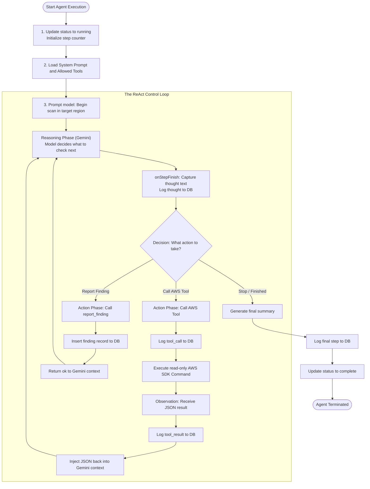

# Cirrus: Technical Documentation and Systems Architecture Manual

**By:** Ritvik Indupuri  
**Date:** June 12, 2026  

---

## Table of Contents

1. [Executive Summary](#executive-summary)
2. [System Architecture](#system-architecture)
   - [System Components](#system-components)
   - [Data Flow Pathways](#data-flow-pathways)
3. [Agent Architecture](#agent-architecture)
   - [The ReAct Autonomous Loop](#the-react-autonomous-loop)
   - [Core Agent Profiles](#core-agent-profiles)
4. [Core Feature Specifications](#core-feature-specifications)
   - [Zero-Trust AWS Credentials Lifecycle](#zero-trust-aws-credentials-lifecycle)
   - [Custom Agent DSL Safety Validation Engine](#custom-agent-dsl-safety-validation-engine)
   - [Remediation Playbook Compiler and CloudFormation Auditing](#remediation-playbook-compiler-and-cloudformation-auditing)
   - [Real-Time WebSockets Timeline with Regex Parsing](#real-time-websockets-timeline-with-regex-parsing)
   - [Baseline Drift Scheduling and Reminders Engine](#baseline-drift-scheduling-and-reminders-engine)
   - [Client-Side PDF Penetration Test Report Generation](#client-side-pdf-penetration-test-report-generation)
5. [Database Schema Design](#database-schema-design)
6. [Conclusion](#conclusion)

---

## Executive Summary

Cirrus is an advanced, self-governing cloud security auditing platform designed to discover vulnerabilities and automate remediation deployments within AWS environments. In contrast to legacy security scanners that rely on static signature detection, Cirrus employs a distributed, multi-agent AI system powered by gemini-3.5-flash. This enables context-aware cloud security audits, mimicking the logical progression of human security engineers.

A fundamental design constraint of Cirrus is its Zero-Trust model. Security access credentials are never stored on persistent storage tiers, neutralizing database leaks. Remediation is handled programmatically via CloudFormation with full deployment lifecycle logging, allowing operators to deploy verified remediations and rollback configurations.

---

## System Architecture

The following diagram illustrates the relationship between the client browser interface, the server functions, the persistence engine, and the external targets.

```mermaid
graph TD
    Client["Client Browser SPA"]
    SessionStorage["sessionStorage (Local Keys)"]
    Server["Server Functions (API Engine)"]
    Database["Supabase Database"]
    Gemini["Google Gemini AI"]
    AWS["Target AWS Cloud Context"]

    Client <--> SessionStorage
    Client -->|1. Dispatch scan request with keys| Server
    Server <-->|2. Autonomous reasoning / tool prompts| Gemini
    Server -->|3. Query audit / deploy fixes| AWS
    Server -->|4. Log timeline steps & findings| Database
    Database -.-->|5. Real-time WebSocket updates| Client
```
<p align="center"><strong>Figure 1: Cirrus System Architecture and Orchestration Gateway</strong></p>

### System Components

#### Client Tier
A Single Page Application (SPA) built using React, TanStack Start, and Tailwind CSS. The client orchestrates the temporary storage of target credentials inside the browser's `sessionStorage` context. It subscribes to Supabase Realtime WebSocket changes to feed data to the timeline views.

#### Backend API Tier
Implemented as type-safe Server Functions running on the TanStack Start framework (powered by the Nitro server engine). These server functions act as secure RPC endpoints, intercepting user-provided AWS credentials, initializing the agent loops, and immediately discarding credentials upon request termination.

#### Persistent Storage Tier
A Supabase PostgreSQL database holding scan records, scheduled baselines, vulnerabilities, and detailed agent thought histories. It maintains no references to AWS Access Keys or Secret Keys.

#### Core AI Tier
Driven by `gemini-3.5-flash` using Vercel AI SDK integration. The model acts as the reasoning core for agents and remediation playbooks.

---

## Agent Architecture

Agents operate on the Reasoning and Action (ReAct) paradigm. This framework allows the model to observe target outputs, formulate reasoning logs, and invoke read-only auditing tools.


<p align="center"><strong>Figure 2: ReAct Control Loop of the Auditing Agent</strong></p>

### Core Agent Profiles

#### Recon Agent
Discovers Caller Identities (`sts:GetCallerIdentity`), lists account aliases, identifies all enabled regions in the account, and checks account-level IAM summary details to detect insecure root configurations.

#### IAM Auditor
Queries users, active access keys, groups, roles, and attached policies. It flag administrative over-privileges, unrotated credentials, and wildcard policy structures.

#### S3 Hunter
Audits all S3 buckets for the presence of bucket policies, public access blocks, and Server-Side Encryption (SSE) details.

#### EC2 / Network Agent
Scans active security groups and instances within the configured target region. It correlates running public instances with open network routes (e.g. SSH port 22, database ports) open to the world.

#### Custom Agents
Dynamic agent structures created using the Custom Agent Builder. These compile prompts and map target tools based on five extended target services: RDS, Lambda, DynamoDB, KMS, and CloudTrail.

---

## Core Feature Specifications

### Zero-Trust AWS Credentials Lifecycle
Credentials entered by the user are cached in the browser's volatile memory context (`sessionStorage`). When a scan is initiated, the client makes a POST request to `runScan`. The backend receives the keys, passes them to the in-memory AWS SDK client constructors, runs the auditing loop, and closes the connection. The credentials are never written to server logs, database tables, or persistent disk storage.

### Custom Agent DSL Safety Validation Engine
Custom agents permit users to construct their own prompts. To prevent agents from attempting destructive tasks in the target cloud, Cirrus runs a custom Domain-Specific Language (DSL) validator during configuration changes.
* **Checks**: Audits prompts against forbidden mutating verbs (e.g. `delete`, `terminate`, `create`, `attach`, `modify`, `update`, `put`).
* **Enforcements**: Statically flags warnings in the editor and locks save features if critical violations are detected. During runtime, if a forbidden command is identified, the runner registers a security warning in the timeline and logs a `blocked_calls` audit event.

### Remediation Playbook Compiler and CloudFormation Auditing
When an agent reports a finding, the system generates a remediation playbook structure:
1. **Explanation**: Clear rationale of the vulnerability and risk.
2. **CLI**: Clean AWS CLI command configurations for manual fixes.
3. **CloudFormation YAML**: A declarative code block representing the target fix.
4. **Rollback Playbook**: Commands to reverse the remediation if it breaks dependencies.

#### Capability Validation
If the generated CloudFormation template creates or alters IAM roles, the system detects `AWS::IAM::` resource definitions and locks the deployment button. The operator must check the acknowledgment checkbox (`CAPABILITY_NAMED_IAM`) before the stack can be deployed.

#### Deployment Polling
When applied, the Server Function uses `DescribeStackEventsCommand` to poll the status of the CloudFormation stack. Every resource change event (e.g., `CREATE_IN_PROGRESS`, `CREATE_COMPLETE`, `ROLLBACK_IN_PROGRESS`) is saved and displayed to the user in real-time.

### Real-Time WebSockets Timeline with Regex Parsing
The scan results interface displays execution timeline segments streamed from PostgreSQL. Users can search logs using exact match filtering or compile regular expression patterns. An active regex compilation check handles syntax errors gracefully, ensuring search bars remain functional during typing.

### Baseline Drift Scheduling and Reminders Engine
Users can define schedules to run scans periodically (e.g., weekly) to detect configuration drift against baseline snapshots. Because the zero-trust model precludes the storage of access keys, the server triggers a reminder email via Resend when a scheduled scan is due. This email requests that the user log in and provide their temporary AWS credentials to execute the drift evaluation scan.

### Client-Side PDF Penetration Test Report Generation
To support reporting and compliance workflows, Cirrus includes a client-side PDF document compilation system built with `jsPDF` and `jsPDF-autotable`.
* **Execution**: When a scan status transitions to `complete`, the user interface displays a "Download Report" action button.
* **Compilation**: Clicking the button triggers an in-memory document compilation loop. The client gathers scan metadata and all linked findings.
* **Document Structure**: Generates a professional multi-page document featuring:
  - Title page with target account identifiers, scan region, and timestamps.
  - Executive summary paragraph describing the scope.
  - A structured findings distribution table segmented by severity.
  - Detailed findings section displaying the resource name, severity badge, and AI description for each vulnerability.
  - Dynamic page numbering footer (e.g., "Page X of Y").
* **Zero Server Overhead**: The PDF is compiled entirely on the client, eliminating server-side rendering loads and ensuring report contents are never cached on the backend filesystem.

---

## Database Schema Design

The persistence tier utilizes PostgreSQL with real-time replication enabled for step tracking.

### scans
Tracks the overarching scan execution metadata.
* `id` (UUID, Primary Key)
* `user_id` (UUID, Foreign Key)
* `name` (TEXT)
* `region` (TEXT)
* `status` (TEXT): pending, running, complete, error
* `selected_agents` (JSONB)
* `custom_agent_ids` (JSONB)
* `started_at` (TIMESTAMPTZ)
* `completed_at` (TIMESTAMPTZ)

### agent_runs
Tracks the execution metadata of each individual agent within a scan.
* `id` (UUID, Primary Key)
* `scan_id` (UUID, Foreign Key)
* `agent_type` (TEXT)
* `custom_agent_id` (UUID, Foreign Key, Nullable)
* `status` (TEXT)
* `summary` (TEXT)
* `blocked_calls` (JSONB)
* `started_at` (TIMESTAMPTZ)
* `completed_at` (TIMESTAMPTZ)

### agent_steps
The transactional database ledger tracking individual ReAct loop steps.
* `id` (UUID, Primary Key)
* `agent_run_id` (UUID, Foreign Key)
* `step_index` (INTEGER)
* `kind` (TEXT): thought, tool_call, tool_result, final
* `thought` (TEXT)
* `tool_name` (TEXT)
* `tool_input` (JSONB)
* `tool_output` (JSONB)
* `error` (TEXT)

### findings
Vulnerabilities reported by agents.
* `id` (UUID, Primary Key)
* `scan_id` (UUID, Foreign Key)
* `agent_run_id` (UUID, Foreign Key)
* `severity` (TEXT): info, low, medium, high, critical
* `title` (TEXT)
* `description` (TEXT)
* `resource` (TEXT)
* `evidence` (JSONB)
* `remediation` (JSONB)

---

## Conclusion

Cirrus represents a secure approach to automated cloud penetration testing. By combining an autonomous ReAct loop powered by gemini-3.5-flash with a Zero-Trust key lifecycle, the platform provides deep security auditing without exposing sensitive access keys to database leaks. With its built-in safety validators, structured remediation playbooks, and detailed CloudFormation audit logging, Cirrus provides cloud administrators with a toolset to identify vulnerabilities, monitor configuration drift, and apply fixes safely.
