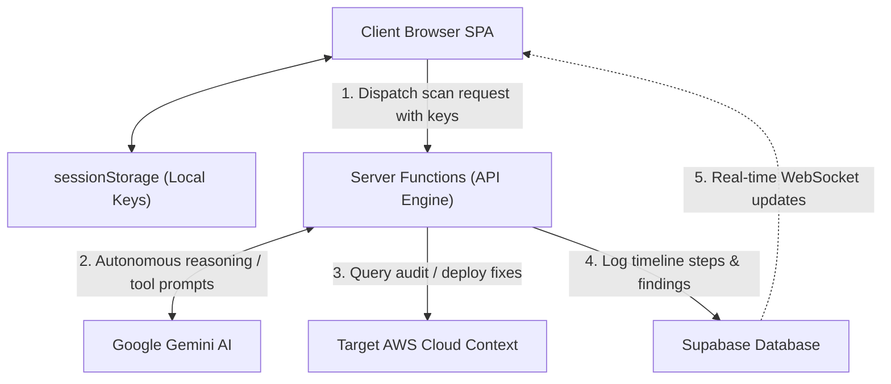

# Cirrus: Technical Documentation and Systems Architecture Manual

**By:** Ritvik Indupuri  
**Date:** June 12, 2026  

---

## Table of Contents

1. [Executive Summary](#executive-summary)
2. [System Architecture](#system-architecture)
   - [System Components](#system-components)
   - [Data Flow Pathways](#data-flow-pathways)
3. [Agent Architecture](#agent-architecture)
   - [The ReAct Autonomous Loop](#the-react-autonomous-loop)
   - [Core Agent Profiles](#core-agent-profiles)
   - [Hallucination Prevention and Grounding Controls](#hallucination-prevention-and-grounding-controls)
4. [Core Feature Specifications](#core-feature-specifications)
   - [Zero-Trust AWS Credentials Lifecycle](#zero-trust-aws-credentials-lifecycle)
   - [Custom Agent DSL Safety Validation Engine](#custom-agent-dsl-safety-validation-engine)
   - [Remediation Playbook Compiler and CloudFormation Auditing](#remediation-playbook-compiler-and-cloudformation-auditing)
   - [Real-Time WebSockets Timeline with Regex Parsing](#real-time-websockets-timeline-with-regex-parsing)
   - [Baseline Drift Scheduling and Reminders Engine](#baseline-drift-scheduling-and-reminders-engine)
   - [Client-Side PDF Penetration Test Report Generation](#client-side-pdf-penetration-test-report-generation)
5. [Database Schema Design](#database-schema-design)
6. [Conclusion](#conclusion)

---

## Executive Summary

Cirrus is an advanced, self-governing cloud security auditing platform designed to discover vulnerabilities and automate remediation deployments within AWS environments. In contrast to legacy security scanners that rely on static signature detection, Cirrus employs a distributed, multi-agent AI system powered by gemini-3.5-flash. This enables context-aware cloud security audits, mimicking the logical progression of human security engineers.

A fundamental design constraint of Cirrus is its Zero-Trust model. Security access credentials are never stored on persistent storage tiers, neutralizing database leaks. Remediation is handled programmatically via CloudFormation with full deployment lifecycle logging, allowing operators to deploy verified remediations and rollback configurations.

---

## System Architecture

The following diagram illustrates the relationship between the client browser interface, the server functions, the persistence engine, and the external targets.


<p align="center"><strong>Figure 1: Cirrus System Architecture and Orchestration Gateway</strong></p>

### System Components

#### Client Tier
The user interface is structured as a React Single Page Application (SPA) utilizing TanStack Start for client-side routing hydration and state management. 
* **State Management**: Session variables (`accessKeyId`, `secretAccessKey`, `sessionToken`, `region`) are captured in memory and stored locally in the browser's `sessionStorage`. When the user is on pages like `/scans/new` or `/scans/$scanId`, UI components load credentials dynamically using the `getAwsCreds()` hook from `aws-creds.ts`. 
* **Real-time Event Streaming**: Managed by instantiating a Supabase WebSocket connection. The app subscribes to table changes:
  ```typescript
  supabase
    .channel('public:agent_steps')
    .on('postgres_changes', { event: 'INSERT', schema: 'public', table: 'agent_steps' }, (payload) => {
      // Append step detail to state timeline array
    })
    .subscribe();
  ```
  This listener enables live thought logging in `execution-timeline.tsx` as soon as the database receives an entry.

#### Backend API Tier
Implemented as type-safe Server Functions using the TanStack Start framework (`createServerFn()`), mapped onto the Nitro server engine. Standard RPC methods include `runScan`, `replayAgentNode`, `runScheduledScan`, and `generateRemediation`.
* **Request Validation**: Incoming requests are validated structurally using Zod schemas (`AwsCredsSchema`, `StartScanInput`). 
* **JWT Authentication**: Auth is enforced via custom middleware (`requireSupabaseAuth`), which decodes the token from the request header, verifies the session, and injects `context.supabase` and `context.userId` parameters into the function runtime context.
* **Transient Payload Handling**: The server intercepts the temporary AWS keys in the request payload, initializes the SDK client constructors in-memory, runs the executor loop, and clears the context variables immediately. No credential values are logged, serialized, or written to server disk.

#### Persistent Storage Tier
A PostgreSQL database hosted on Supabase. The database architecture separates transaction-heavy step logs from persistent configuration data:
* **Relational Integrity**: The `agent_runs` table has foreign key constraints linking to `scans.id` with CASCADE deletes, ensuring timeline cleanups. The `agent_steps` table links to `agent_runs.id` to clear intermediate execution artifacts whenever an operator clicks "Replay Node".
* **Replication**: Table triggers automatically push changes to the Supabase Realtime WebSocket server for immediate client distribution.

#### Core AI Integration
Powered by Vercel AI SDK (`ai`) integrated with the official Google Generative AI Provider (`@ai-sdk/google`) using the `createGoogleGenerativeAI` wrapper. The AI engine handles the translation of LLM responses into structured tool calls and maps tool execution outputs back to the context window of `gemini-3.5-flash`.

---

## Agent Architecture

Agents operate on the Reasoning and Action (ReAct) paradigm. This framework allows the model to observe target outputs, formulate reasoning logs, and invoke read-only auditing tools.


<p align="center"><strong>Figure 2: ReAct Control Loop of the Auditing Agent</strong></p>

### Core Agent Profiles

#### Recon Agent
Focuses on identifying the boundary configurations of the configured credentials. 
* **Tools**: Uses `aws_sts_get_caller_identity` (evaluates authenticated role ARN and Account ID), `aws_iam_list_account_aliases`, `aws_ec2_describe_regions` (enumerates active target regions), and `aws_iam_get_account_summary` (checks counts of users, MFA configurations, and password policies).
* **Vulnerability Criteria**: Flags findings such as root account key usage, lack of active MFA, or over-exposed region parameters.

#### IAM Auditor
Focuses on mapping user rights and detecting privilege escalations.
* **Tools**: Calls `aws_iam_list_users` and `aws_iam_list_roles`, then performs secondary checks on high-value entries via `aws_iam_list_attached_user_policies`, `aws_iam_list_attached_role_policies` (checks for `AdministratorAccess` policies), and `aws_iam_list_access_keys`.
* **Vulnerability Criteria**: Flags wildcard privileges, inactive users with console access, and credentials/keys that have not been rotated in 90 days.

#### S3 Hunter
Focuses on bucket settings and data privacy leaks.
* **Tools**: Begins with `aws_s3_list_buckets` to gather targets. Next, iterates over target buckets (capped at 8 per scan to preserve memory limits) and queries:
  * `aws_s3_get_public_access_block` (verifies account-level blocks).
  * `aws_s3_get_bucket_policy_status` (checks for `IsPublic=true` flags).
  * `aws_s3_get_bucket_encryption` (verifies SSE SSE-KMS configurations).
* **Vulnerability Criteria**: Flags exposed bucket policies (Critical), disabled public access blocks (High), and disabled server-side encryption (Medium).

#### EC2 / Network Agent
Scans public-facing computing resources and ingress boundaries.
* **Tools**: Calls `aws_ec2_describe_security_groups` to evaluate active rules, parsing port protocols. Calls `aws_ec2_describe_instances` to capture network interface configurations, public IP mappings, and linked security groups.
* **Vulnerability Criteria**: Flags wide-open administration ports (SSH/22, RDP/3389) or database ports open to the public (`0.0.0.0/0` or `::/0`), especially when linked to active running computing instances.

#### Custom Agents
Dynamic agent structures created using the Custom Agent Builder. These compile custom system prompts and dynamically map target read-only tools based on five extended target services:
* **RDS**: `aws_rds_describe_db_instances` (checks storage encryption and public DB flags).
* **Lambda**: `aws_lambda_list_functions` and `aws_lambda_get_policy` (audits trigger exposures).
* **DynamoDB**: `aws_dynamodb_list_tables` and `aws_dynamodb_describe_table` (checks KMS keys and table configurations).
* **KMS**: `aws_kms_list_keys`, `aws_kms_describe_key` (checks key state and rotation), and `aws_kms_get_key_policy` (verifies key access rules).
* **CloudTrail**: `aws_cloudtrail_describe_trails` and `aws_cloudtrail_get_trail_status` (verifies trail logging states).

### Hallucination Prevention and Grounding Controls

To ensure that agents make decisions based on real AWS data and do not invent or hallucinate configurations or vulnerabilities, Cirrus enforces four grounding controls at the systems architecture level:

* **Tool-Grounded Observation Constraint**: The agent prompt engine strictly instructs the model that it is forbidden from referencing any AWS resource, user, policy, bucket, or instance unless that exact resource was returned in a previous `tool_result` step. The system prompt enforces: `"Use the available tools. Do not invent data."`
* **Context Window Sandboxing**: Custom agents are only loaded with the tools matching their selected service configuration parameters. If an agent tries to invent or call non-existent tools, the Vercel AI SDK runtime throws an exception or the model context rejects the schema.
* **Structured Schema Grounding**: The `report_finding` tool forces the model to structure output parameters explicitly through a Zod schema requiring `severity`, `title`, `description`, and `resource`. The model cannot report generalized findings without providing the exact ARN or resource identifier retrieved from an active `tool_result` observation block.
* **Mandatory Step Reasoning**: Every step in the ReAct loop forces the model to log a `thought` describing its intent prior to executing the tool command. This step-by-step reasoning (Chain-of-Thought) forces the model to logically map its queries and prevents it from jumping to unsupported conclusions or inventing vulnerabilities.

---

## Core Feature Specifications

### Zero-Trust AWS Credentials Lifecycle
Credentials entered by the user are cached in the browser's volatile memory context (`sessionStorage`). When a scan is initiated, the client makes a POST request to `runScan`. The backend receives the keys, passes them to the in-memory AWS SDK client constructors, runs the auditing loop, and closes the connection. The credentials are never written to server logs, database tables, or persistent disk storage.

### Custom Agent DSL Safety Validation Engine
Custom agents permit users to construct their own prompts. To prevent agents from attempting destructive tasks in the target cloud, Cirrus runs a custom Domain-Specific Language (DSL) validator during configuration changes.
* **Checks**: Audits prompts against forbidden mutating verbs (e.g. `delete`, `terminate`, `create`, `attach`, `modify`, `update`, `put`).
* **Enforcements**: Statically flags warnings in the editor and locks save features if critical violations are detected. During runtime, if a forbidden command is identified, the runner registers a security warning in the timeline and logs a `blocked_calls` audit event.

### Remediation Playbook Compiler and CloudFormation Auditing
When an agent reports a finding, the system generates a remediation playbook structure:
1. **Explanation**: Clear rationale of the vulnerability and risk.
2. **CLI**: Clean AWS CLI command configurations for manual fixes.
3. **CloudFormation YAML**: A declarative code block representing the target fix.
4. **Rollback Playbook**: Commands to reverse the remediation if it breaks dependencies.

#### Capability Validation
If the generated CloudFormation template creates or alters IAM roles, the system detects `AWS::IAM::` resource definitions and locks the deployment button. The operator must check the acknowledgment checkbox (`CAPABILITY_NAMED_IAM`) before the stack can be deployed.

#### Deployment Polling
When applied, the Server Function uses `DescribeStackEventsCommand` to poll the status of the CloudFormation stack. Every resource change event (e.g., `CREATE_IN_PROGRESS`, `CREATE_COMPLETE`, `ROLLBACK_IN_PROGRESS`) is saved and displayed to the user in real-time.

### Real-Time WebSockets Timeline with Regex Parsing
The scan results interface displays execution timeline segments streamed from PostgreSQL. Users can search logs using exact match filtering or compile regular expression patterns. An active regex compilation check handles syntax errors gracefully, ensuring search bars remain functional during typing.

### Baseline Drift Scheduling and Reminders Engine
Users can define schedules to run scans periodically (e.g., weekly) to detect configuration drift against baseline snapshots. Because the zero-trust model precludes the storage of access keys, the server triggers a reminder email via Resend when a scheduled scan is due. This email requests that the user log in and provide their temporary AWS credentials to execute the drift evaluation scan.

### Client-Side PDF Penetration Test Report Generation
To support reporting and compliance workflows, Cirrus includes a client-side PDF document compilation system built with `jsPDF` and `jsPDF-autotable`.
* **Execution**: When a scan status transitions to `complete`, the user interface displays a "Download Report" action button.
* **Compilation**: Clicking the button triggers an in-memory document compilation loop. The client gathers scan metadata and all linked findings.
* **Document Structure**: Generates a professional multi-page document featuring:
  - Title page with target account identifiers, scan region, and timestamps.
  - Executive summary paragraph describing the scope.
  - A structured findings distribution table segmented by severity.
  - Detailed findings section displaying the resource name, severity badge, and AI description for each vulnerability.
  - Dynamic page numbering footer (e.g., "Page X of Y").
* **Zero Server Overhead**: The PDF is compiled entirely on the client, eliminating server-side rendering loads and ensuring report contents are never cached on the backend filesystem.

---

## Database Schema Design

The persistence tier utilizes PostgreSQL with real-time replication enabled for step tracking.

### scans
Tracks the overarching scan execution metadata.
* `id` (UUID, Primary Key)
* `user_id` (UUID, Foreign Key)
* `name` (TEXT)
* `region` (TEXT)
* `status` (TEXT): pending, running, complete, error
* `selected_agents` (JSONB)
* `custom_agent_ids` (JSONB)
* `started_at` (TIMESTAMPTZ)
* `completed_at` (TIMESTAMPTZ)

### agent_runs
Tracks the execution metadata of each individual agent within a scan.
* `id` (UUID, Primary Key)
* `scan_id` (UUID, Foreign Key)
* `agent_type` (TEXT)
* `custom_agent_id` (UUID, Foreign Key, Nullable)
* `status` (TEXT)
* `summary` (TEXT)
* `blocked_calls` (JSONB)
* `started_at` (TIMESTAMPTZ)
* `completed_at` (TIMESTAMPTZ)

### agent_steps
The transactional database ledger tracking individual ReAct loop steps.
* `id` (UUID, Primary Key)
* `agent_run_id` (UUID, Foreign Key)
* `step_index` (INTEGER)
* `kind` (TEXT): thought, tool_call, tool_result, final
* `thought` (TEXT)
* `tool_name` (TEXT)
* `tool_input` (JSONB)
* `tool_output` (JSONB)
* `error` (TEXT)

### findings
Vulnerabilities reported by agents.
* `id` (UUID, Primary Key)
* `scan_id` (UUID, Foreign Key)
* `agent_run_id` (UUID, Foreign Key)
* `severity` (TEXT): info, low, medium, high, critical
* `title` (TEXT)
* `description` (TEXT)
* `resource` (TEXT)
* `evidence` (JSONB)
* `remediation` (JSONB)

---

## Conclusion

Cirrus represents a secure approach to automated cloud penetration testing. By combining an autonomous ReAct loop powered by gemini-3.5-flash with a Zero-Trust key lifecycle, the platform provides deep security auditing without exposing sensitive access keys to database leaks. With its built-in safety validators, structured remediation playbooks, and detailed CloudFormation audit logging, Cirrus provides cloud administrators with a toolset to identify vulnerabilities, monitor configuration drift, and apply fixes safely.
